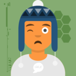
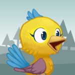
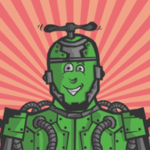
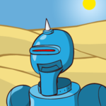
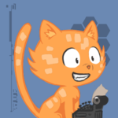

# Avathor

Avathor is a specification that generates unique avatar images for nodes on the Bitcoin Lightning network. It can be implemented across multiple wallets or services. This means the same Lightning node will have the same Avatar image in all the applications supporting it.
  

## Why Avathor?
- Avathor allows to hide complexity and makes the UX in general more appealing. 
Instead of displaying node PubKeys (long hex strings) it is often enough to just display an avatar.
- Avathor allows to create nice looking contact lists while only saving public keys. 
No need for any user accounts or third party services. 
Just save contacts without leaking any data!
- Avathor can help to make a quick sanity check.  
While it is visually hard to check if two node PubKeys are identical, it is very simple with Avathor. This can help against attacks that modified your clipboard content for example.
  

## Implementation

The following list contains ready to use implementations for specific programming languages:
- Java (Android)

If the list does not contain what you need, you can create your own implementation by following the [specification](REFERENCE.md).
  

## Examples
Click [here](EXAMPLES.md) for more examples.
  

## Licenses & Attribution
The idea for this project was mainly inspired by [robohash](https://robohash.org/).
Thanks for that great project!

The licenses and attribution for the artwork follows below.
If you use any of the images from the assets folder for your own projects, make sure to give proper attribution.

- The "robots" artwork and the some of the backgrounds (abstract_01 & travel_01) were created by Zikri Kader.  
They are available under CC-BY-3.0 or CC-BY-4.0 license.

- The "aliens" artwork was created by Hrvoje Novakovic. 
They are available under CC-BY-3.0 license.

- The "animals" (cats & birds) artwork was created by David Revoy.  
They are available under CC-BY-4.0 license.  
https://www.peppercarrot.com/en/article391/cat-avatar-generator

- The "humans" artwork was created by Pablo Stanley, for https://avataaars.com/. 
They are "Free for personal and commercial use."

- The backgrounds abstract_02 and travel_02 are images taken from various artists from pixabay.com (CC0) which were adapted and optimized by Johannes Wuensch.