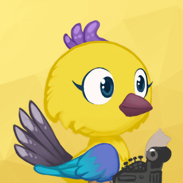

# Avathor specification

### Keep it local
The creation of avatar images should be performed locally on the device. 
The images are highly optimized and the library is just 3.8 mb in size to minimize impact on mobile devices. 
If a webserver was used to create the images, the pubkeys you used would be leaked to that service. Combined with the IP this could reveal a users identity. So, don't do it.

### Use the image set of this specification
To ensure all clients create the same images, the image set from this project has to be used.  
The folder structure and naming is important and must not be altered.
  

## From PubKey to Avathor

### Preparing the data
To make Avathor easily usable for potential future usecases, the unique identifier is generated by calculating the sha-256 of a lowercase UTF-8 String.

For a node pubkey we use the lowercase hex format and hash it using sha-256.

### Reading the data

Example PubKey:  
02ef2da605f5e9cc3f6a042f3258e7eec3ea442aadc4299ced0f8ec06d444ad8b8

sha-256 of PubKey: 
5b146fadb0182f5d609992b74e4f4448a193671f1f43af803c7325026e451424
 

To make it easier to read, here is the hash from above seperated into groups:  
5b&nbsp;&nbsp;14&nbsp;&nbsp;6f&nbsp;&nbsp;ad&nbsp;&nbsp;b018&nbsp;&nbsp;2f5d&nbsp;&nbsp;...&nbsp;&nbsp;1424   

byte    |example    |description 
---     |---        |---        
0       |5b         |background set 
1       |14         |background 
2       |6f         |avatar set 
3       |ad         |avatar subset
4-5     |b018       |component 1
6-7     |2f5d       |component 2
...     |...        |...
30-31   |1424       |component 14 

 

A folder or an image is always selected by the following procedure: 
1. Calculate i by converting the byte(s) of the desired group to a big endian integer
2. Get the number n of possibilities for that group.
3. Get the desired folder/image index by using the modulo operator: i % n

Each folder in a subset represents one component.
Loop through all folders of a subset and choose one image as the component with the algorithm from above.

### Combining the images: 
The image layers are always painted on top of each other. We start with the background, then Component 1, Component 2 etc.

 

### Detailed example
Here is a detailed explanation of how the example from above is processed:

First we have to determine which background set to use.
Therefore we have to check the "backrounds" folder for how many subfolders it has.
There are 4.
We then read byte 0 of our hash which is 5b. Converting 5b to decimal results in 91.
Now we calculate the final index. 
91 % 4 = 3  
-> We choose the background set at index 3 which is "travel_02". (Remember that index starts at 0)  

Now we count how many images the "travel_02" folder has. The answer is 16.
We read byte 1 of our hash which is 14. Converting 14 to decimal results in 20.
We then calculate the final index. 
20 % 16 = 4  
-> We choose image "bg_travel2_05".

To calculate which avatar set to use, we count the subfolders in the "sets" folder which is 4.
We then read byte 2 of our hash which is 6f. Converting 6f to decimal results in 111.
We then calculate the final index. 
111 % 4 = 3  
-> We choose "robots" as set.

Now we count the subsets in the "robots" folder. There are 10.
We read byte 3 of our hash which is ad. converting ad to decimal results in 173.  
173 % 10 = 3  
-> We choose "grey" as subset.

Now we loop through all the subfolders of "grey". 
First iteration: 
We count the images in the first folder (000#Body). The result is 10.
For the first iteration we use the bytes 4-5 of our hash which is b018. Converting b018 to decimal results in 45080. 
45080 % 10 = 0  
-> We choose "grey_body-01.png" for the first component.

Second iteration: 
Same procedure, just with folder 001#Face and bytes 6-7.

...

The 5th iteration is the last one in this example.
This means the bytes 12-13 are the last ones that affect the image.
The rest is ignored.
  

## Test vectors:

PubKey 1:  
02ef2da605f5e9cc3f6a042f3258e7eec3ea442aadc4299ced0f8ec06d444ad8b8 

PubKey 2:  
028F2DA605F5E9CC3F6A042F3258E7EEC3EA442AADC4299CED0F8EC06D444AD8B8 
